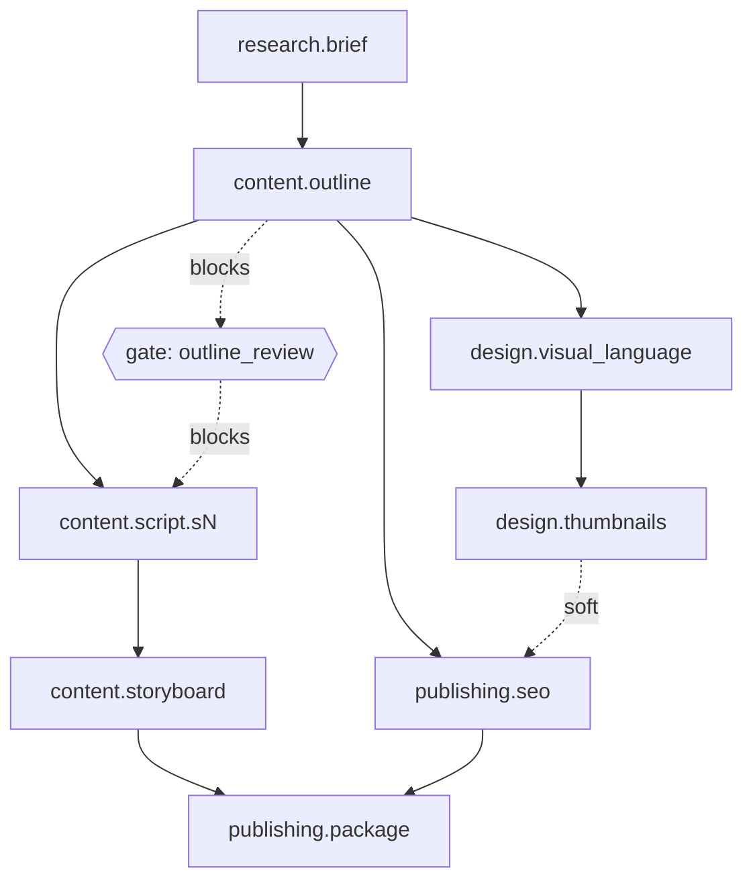

# showrunner

Multi-agent content production system: one orchestrator (the Director) coordinates
four specialist agents over a task DAG to turn a content idea into an editable
workspace. Agentic content pipeline with hub-and-spoke orchestration —
workers never communicate directly; all coordination flows through structured
JSON, events, and shared Postgres state. Dependency-graph staleness enables
selective regeneration without destroying user edits.

## Architecture

The Director is the only component that talks to more than one agent. Each of
the four specialist agents (research, content, design, publishing) receives a
`TaskEnvelope`, does its work in isolation, and returns an `AgentResult` —
agents never call each other or share memory directly. Every handoff, retry,
and staleness cascade is mediated by the Director reading and writing shared
Postgres state (`task_nodes`, `artifacts`), which is what lets the system
resume after a crash, pause at a human review gate, and selectively
regenerate only what a user's edit actually invalidated.

## DAG



`content.script.sN` is expanded at plan time into one node per script section.
The `outline_review` gate blocks all `content.script.*` nodes until a human
approves via `POST /projects/{id}/gates/outline_review/approve`.

## Stack

- **Backend**: Python 3.12, FastAPI, LangGraph (in-process, Postgres
  checkpointer), Pydantic v2, supabase-py. No Docker, no Redis, no queue —
  the Director graph runs inside a FastAPI background task.
- **Frontend**: Next.js 15 (App Router), TypeScript, Tailwind, a small local
  component system (`web/components/ui/`), Supabase Auth (magic link) for
  sign-in.
- **Database & Auth**: Supabase Postgres + Supabase Auth.

## Setup

### Database

1. Create a Supabase project (or point `DATABASE_URL` at any Postgres 15+ instance).
2. Run every migration, in order:
   ```
   cd api
   python -m venv .venv
   .venv/Scripts/activate   # .venv/bin/activate on macOS/Linux
   pip install -r requirements.txt
   cp ../.env.example ../.env   # fill in values, see below
   python scripts/run_migration.py
   ```
   (Or apply `migrations/*.sql` by hand, in filename order, with `psql`.)

### Environment variables (`.env` at the repo root)

| Variable | Where to find it |
|---|---|
| `SUPABASE_URL` | Supabase dashboard → Settings → API |
| `SUPABASE_SERVICE_KEY` | Supabase dashboard → Settings → API (`service_role`, server-only — never expose to a browser) |
| `SUPABASE_JWT_SECRET` | Supabase dashboard → Settings → API → JWT Settings ("Legacy JWT secret" on HS256 projects) |
| `DATABASE_URL` | Supabase dashboard → Settings → Database (connection string) |
| `GEMINI_API_KEY`, `GROQ_API_KEY` | Primary LLM + fallback (`llm/client.py` tries Gemini first, falls back to Groq if it fails for any reason) |
| `TAVILY_API_KEY` | Web search grounding for the Research agent |

### API

```
cd api
python run.py
```

Use `python run.py`, **not** `uvicorn app.main:app --reload` directly — on
Windows, the plain uvicorn CLI creates its event loop before importing the
app, which is too late for the Windows-compatibility fix psycopg's async
mode needs (see `run.py`'s docstring). `run.py` sets that up first. This
distinction doesn't matter on Linux, where the underlying bug doesn't exist.

Run tests:

```
cd api
pytest
```

### Web

```
cd web
npm install
npm run dev
```

Env vars (`web/.env.local`):

| Variable | Value |
|---|---|
| `NEXT_PUBLIC_API_URL` | The running API's URL, e.g. `http://localhost:8000` |
| `NEXT_PUBLIC_SUPABASE_URL` | Same Supabase project as the backend |
| `NEXT_PUBLIC_SUPABASE_ANON_KEY` | Supabase dashboard → Settings → API (`anon`/`public` — safe for the browser, distinct from the service key above) |

## Auth

Sign-in is magic-link (passwordless) via Supabase Auth, client-side only —
see `web/hooks/useAuth.ts` and `web/components/AuthControl.tsx`. Project
creation and viewing work fully signed-out; a session is only required for
the Timeline view, Export, and the `/account` page (a signed-in user's own
project list). The backend verifies a session's JWT itself
(`api/app/auth.py`) rather than trusting the frontend — real Supabase
session tokens are ES256-signed via a JWKS endpoint, not the HS256
shared-secret scheme the static anon/service keys use, so verification
checks JWKS first with the shared secret as a fallback.

## Project layout

```
showrunner/
├── migrations/                    # 001: core schema. 002: per-user project ownership.
├── api/
│   ├── run.py                     # actual local entrypoint -- see "API" above
│   ├── scripts/                   # one-off dev scripts (migrate, seed, smoke tests)
│   └── app/
│       ├── auth.py                # verifies Supabase session JWTs (JWKS, HS256 fallback)
│       ├── director/               # LangGraph StateGraph, scheduler, triage, node template
│       ├── agents/                 # research / content / design / publishing specialists
│       ├── llm/                    # provider client + structured generation
│       ├── validators/             # word budget, claims grounding, design rules
│       ├── services/               # artifact CRUD, staleness cascade, export, projects
│       └── routes/                 # projects, artifacts, gates
└── web/
    ├── app/
    │   ├── page.tsx                # home: video-idea / product-feature mode select + form
    │   ├── account/                # signed-in user's own project list
    │   └── projects/[id]/          # the DAG + artifact editor workspace
    ├── components/
    │   ├── ui/                     # local Button/Card/Badge/Input/Modal/Skeleton primitives
    │   ├── AuthControl.tsx         # shared sign-in/out UI
    │   ├── DagView.tsx, ArtifactList.tsx, ArtifactEditor.tsx, GatePanel.tsx, StaleBanner.tsx
    │   ├── ProductionTimeline.tsx  # real per-shot timestamps from the storyboard
    │   ├── NodeFailureHelp.tsx     # fallback shown for a permanently-failed node
    │   └── HowToUse.tsx            # in-app explainer, shown once publishing.package exists
    ├── hooks/                      # useAuth, useProjectPoll, useResizableWidth
    └── lib/                        # typed API client, Supabase client, shared types
```
