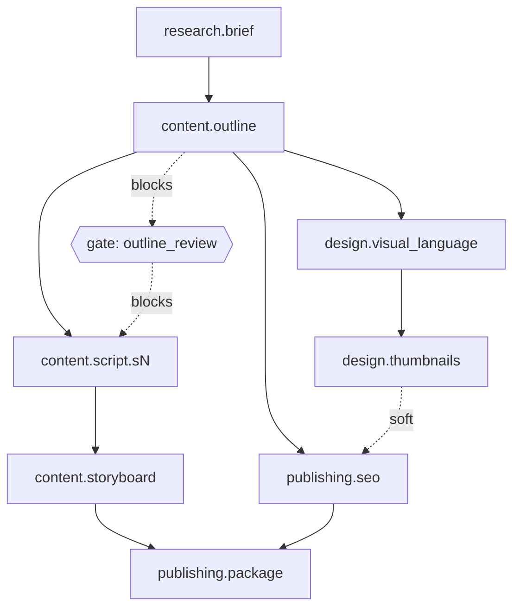

# showrunner

Multi-agent content production system: one orchestrator (the Director) coordinates
four specialist agents over a task DAG to turn a content idea into an editable
workspace. Agentic content pipeline with hub-and-spoke orchestration —
workers never communicate directly; all coordination flows through structured
JSON, events, and shared Postgres state. Dependency-graph staleness enables
selective regeneration without destroying user edits.

## Architecture

The Director is the only component that talks to more than one agent. Each of
the four specialist agents (research, content, design, publishing) receives a
`TaskEnvelope`, does its work in isolation, and returns an `AgentResult` —
agents never call each other or share memory directly. Every handoff, retry,
and staleness cascade is mediated by the Director reading and writing shared
Postgres state (`task_nodes`, `artifacts`), which is what lets the system
resume after a crash, pause at a human review gate, and selectively
regenerate only what a user's edit actually invalidated.

## DAG



`content.script.sN` is expanded at plan time into one node per script section.
The `outline_review` gate blocks all `content.script.*` nodes until a human
approves via `POST /projects/{id}/gates/outline_review/approve`.

## Stack

- **Backend**: Python 3.12, FastAPI, LangGraph (in-process, Postgres
  checkpointer), Pydantic v2, supabase-py. No Docker, no Redis, no queue —
  the Director graph runs inside a FastAPI background task.
- **Frontend**: Next.js 15 (App Router), TypeScript, Tailwind, shadcn/ui.
- **Database**: Supabase Postgres.

## Setup

### Database

1. Create a Supabase project (or point `DATABASE_URL` at any Postgres 15+ instance).
2. Run the migration:
   ```
   psql "$DATABASE_URL" -f migrations/001_init.sql
   ```

### API

```
cd api
python -m venv .venv
.venv/Scripts/activate   # .venv/bin/activate on macOS/Linux
pip install -r requirements.txt
cp ../.env.example ../.env   # fill in values
uvicorn app.main:app --reload
```

Run tests:

```
cd api
pytest
```

### Web

```
cd web
npm install
npm run dev
```

Set `NEXT_PUBLIC_API_URL` (see `.env.example`) to point at the running API.

## Project layout

```
showrunner/
├── migrations/001_init.sql   # schema: projects, task_nodes, artifacts, artifact_versions, artifact_dependencies
├── api/
│   └── app/
│       ├── director/         # LangGraph StateGraph, scheduler, triage, node template
│       ├── agents/           # research / content / design / publishing specialists
│       ├── llm/              # provider client + structured generation
│       ├── validators/       # word budget, claims grounding, design rules
│       ├── services/         # artifact CRUD, staleness cascade, export
│       └── routes/           # projects, artifacts, gates
└── web/
    ├── app/                  # Next.js App Router pages
    ├── components/           # DagView, ArtifactList, ArtifactEditor, GatePanel, StaleBanner
    ├── hooks/useProjectPoll.ts
    └── lib/                  # typed API client + shared types
```
