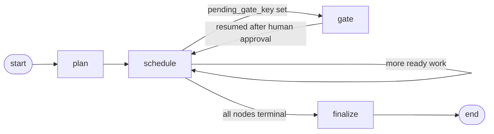

# How the Director works

The Director is the orchestrator in `api/app/director/`. It's the one piece
of the system that knows about the whole task DAG, dispatches work to the
four specialist agents, and persists everything to Postgres. Agents never
talk to each other or to the Director directly — the Director drives a
LangGraph `StateGraph` that repeatedly asks "what's ready?", runs it, and
writes down what happened.

## The five files and what each owns

| File | Owns |
|---|---|
| `template.py` | The fixed DAG shape: which nodes exist, which depend on which, and the one human gate |
| `state.py` | `DirectorState` — the data threaded through every step of one project's run |
| `scheduler.py` | Pure dependency-graph logic: what's ready to run, what to block on failure |
| `triage.py` | What to do with one node's result: advance, retry, or give up |
| `graph.py` | Wires the above into an actual LangGraph `StateGraph` and runs it |

## The graph shape



`interrupt_before=["gate"]` means LangGraph pauses **before** `gate_node`'s
body ever runs — the checkpointer (a real Postgres connection) saves the
paused state, and `graph.ainvoke(...)` simply returns control to the caller.
Nothing resumes until someone calls `ainvoke` again on the same thread with
updated state (that's what `POST /projects/{id}/gates/{key}/approve` will
do — not built yet).

## `DirectorState` — what's carried between steps

```python
class DirectorState(TypedDict):
    project_id: UUID
    nodes: list[TaskNode]        # the full node list, mutated in place tick to tick
    running_node_keys: list[str]
    pending_gate_key: str | None # set mid-tick when a gate is hit; routes to "gate"
    approved_gates: list[str]    # which gate keys a human has already cleared
    max_parallel: int
    done: bool                   # true once every node is in a terminal state
```

`initial_state(project_id)` builds this with empty `nodes` — `plan_node` is
what actually populates it.

## Walking through the four nodes

### `plan_node` — expand the template, create the DB rows

1. Fetches the `Project` row to read `params["section_count"]` (defaults to
   3 if not set).
2. Calls `template.expand_template(section_count)`, which replaces the
   single `content.script.sN` placeholder with concrete `s1..sN` entries and
   rewires `content.storyboard`'s dependency to point at all of them.
3. Bulk-inserts one `task_nodes` row per template entry
   (`services/task_nodes.create_task_nodes`).
4. Sets the project's status to `RUNNING`.
5. Populates `state["nodes"]` and returns.

Runs exactly once per project.

### `schedule_node` — one "tick"

This is the heart of the Director. Each call does one round of work:

1. **Find what's ready.** Calls `scheduler.ready_set(nodes, max_parallel=len(nodes))`
   — deliberately **uncapped**, not capped at `max_parallel` yet (see the
   gate-starvation note below).
2. **Filter out gated nodes.** For each ready node, checks
   `template.GATES` for a gate whose `blocks_node_key_prefix` matches this
   node's key (e.g. `"content.script."` matches `content.script.s1`). If
   that gate's key isn't in `state["approved_gates"]`, the node is held back
   and `state["pending_gate_key"]` is set — it does **not** consume a
   dispatch slot.
3. **Apply the real parallelism cap** to what's left:
   `dispatchable = dispatchable[:state["max_parallel"]]`.
4. **Mark dispatched nodes `RUNNING`** in the DB and in memory.
5. **Run them concurrently** via `asyncio.gather(..., return_exceptions=True)`
   — one agent's raw Python exception (a network blip, a bad `section_key`,
   anything) becomes an `AgentResult(ok=False, error_code="exception")`
   instead of crashing the whole tick.
6. **For each result, apply the outcome** (`_apply_result`):
   - `Decision.ADVANCE` → `services/artifacts.upsert_artifact` persists the
     artifact (the DB trigger snapshots a version automatically), node →
     `SUCCEEDED`.
   - `Decision.RETRY` → node → `QUEUED` again, `attempts` incremented,
     eligible for another tick.
   - `Decision.HALT` → node → `FAILED`, `attempts` incremented, and
     `scheduler.block_hard_dependents` walks the hard edges to mark every
     transitive dependent `BLOCKED`.
   - `Decision.FAIL_SOFT` → node → `FAILED`, and **also** cascades through
     `block_hard_dependents` — but with `status=SKIPPED` instead of
     `BLOCKED`. Dependents must always land in *some* real terminal status;
     leaving them `QUEUED` forever (their hard dependency will never
     `SUCCEED`, but nothing marks them terminal either) means
     `_all_terminal` never passes and the Director loops `schedule_node`
     forever making zero progress. Currently unreachable — no agent emits an
     error_code that triage.decide() maps to FAIL_SOFT yet; see `triage.py`.
7. Sets `state["done"]` if every node is now in a terminal status
   (`SUCCEEDED`/`FAILED`/`BLOCKED`/`SKIPPED`).

### `gate_node` — a deliberate no-op

The pause already happened (`interrupt_before`). By the time this function's
body actually executes, a human has already approved and the graph has been
resumed with `approved_gates` updated. This function just defensively clears
`pending_gate_key`.

### `finalize_node` — close out the project

Checks whether any node ended `FAILED`/`BLOCKED`. Sets the project's final
status to `DONE` or `FAILED` accordingly.

### `route_after_schedule` — the conditional edge

```python
if state["pending_gate_key"] is not None:
    return "gate"       # gate wins even if done is also true
if state["done"]:
    return "finalize"
return "schedule"        # loop back for another tick
```

## `scheduler.py` — the pure logic underneath

Two functions, no I/O, fully unit-tested (`tests/test_scheduler.py`):

- **`ready_set(nodes, max_parallel)`** — a `QUEUED` node is ready once every
  one of its **hard** dependencies has `SUCCEEDED`. Soft dependencies are
  never checked here at all — that's the whole point of "soft."
- **`block_hard_dependents(nodes, failed_node_key, status=NodeStatus.BLOCKED)`**
  — walks the hard-edge graph transitively from a failed node, marking every
  non-terminal dependent with `status` (`BLOCKED` for a HALT, `SKIPPED` for
  a FAIL_SOFT — see `triage.py` below). Soft dependents are untouched, and
  already-terminal nodes are never re-marked. Whichever status is used, it
  must be a real terminal one — leaving dependents `QUEUED` is what caused
  the infinite-loop bug described further down.

## `triage.py` — turning a result into a decision

```python
NODE_MAX_ATTEMPTS = 2  # outer, Director-level retry budget

def decide(node, result) -> Decision:
    if result.ok:
        return Decision.ADVANCE
    if node.attempts < NODE_MAX_ATTEMPTS:
        return Decision.RETRY
    return Decision.HALT
```

This is a **second, outer retry layer**, separate from each agent's own
internal generate → validate → repair loop (`BaseAgent.max_attempts = 3`).
An agent's `.run()` already tried and failed 3 times internally before ever
returning `ok=False` — `triage.decide` is asking "should the *Director* call
`.run()` again from scratch," which matters for transient failures (a
network blip, a Supabase hiccup) that a fresh attempt might clear.

## Three things worth understanding

**1. Gate-starvation fix**, found by running this live. The first version capped `ready_set` at
`max_parallel` *before* filtering out gated nodes — so a gated node sitting
early in the node list could consume a slot and get filtered out anyway,
silently starving other unrelated ready work (e.g. `publishing.seo`) that
never got a chance to run before the graph paused at the gate. Fixed by
requesting the uncapped ready set, filtering gates first, *then* capping.
Regression test: `test_schedule_node_gated_node_does_not_starve_unrelated_ready_work`.

**2. The graph pauses the moment a gate is detected, not once all non-gated
work is drained.** In one live run, `design.thumbnails` was still `QUEUED`
when the graph paused — not because of a bug, but because it only becomes
ready *after* `design.visual_language` succeeds, and the graph paused at the
gate in the very same tick that dependency was satisfied, one tick before
`thumbnails` would have become ready. Nothing is stuck: the first tick after
gate approval picks it up immediately. It's a sequencing choice (pause as
soon as gated, vs. drain everything else first), not a defect — worth
knowing if you're ever staring at a "why hasn't this run yet" state.

**3. FAIL_SOFT's cascade fix**, found by tracing through "why don't we ever
use FAIL_SOFT" rather than by a live run (it's unreachable with today's
agents, so it couldn't have surfaced that way). The first version of
`_apply_result` skipped `block_hard_dependents` entirely for `FAIL_SOFT`,
meaning any hard-dependent of a soft-failed node would sit `QUEUED` forever
— its hard dependency will never `SUCCEED`, but nothing ever marks it
terminal either, so `_all_terminal` never passes and `schedule_node` loops
forever making zero progress. Fixed by giving `block_hard_dependents` a
`status` parameter and cascading `FAIL_SOFT` too, just with `SKIPPED`
instead of `BLOCKED`. Regression tests:
`test_status_param_supports_skipped_for_fail_soft` (scheduler.py) and
`test_schedule_node_fail_soft_skips_dependents_and_still_reaches_done`
(graph.py, forces the otherwise-unreachable decision via a patch).

## What persists where

- `services/task_nodes.py` — `task_nodes` rows: status, attempts, last_error.
- `services/artifacts.py` — `artifacts` rows via `upsert_artifact`
  (`current_version` bumped, `edited_by` cleared since this is an
  agent write, not a human edit). The `BEFORE`→`AFTER INSERT` trigger fix in
  `001_init.sql` is what makes the automatic `artifact_versions` snapshot
  work at all on a first insert.
- `services/projects.py` — `projects.status`
  (`PLANNING → RUNNING → DONE/FAILED`, with `AWAITING_GATE` reserved for
  once the approve route sets it).

## What's still missing

- `POST /projects/{id}/gates/{key}/approve` — the route that actually adds
  a key to `approved_gates` and resumes the paused graph. `gate_node` is
  ready for this; the route itself is still a stub.
- A FastAPI startup hook to call `checkpointer.setup()` once instead of on
  every `build_graph()` call (currently correct, just wasteful).
- `Decision.FAIL_SOFT` has no agent that ever triggers it yet — reserved for
  a future capability that can fail without it meaning the same thing as a
  HALT (see the `_apply_result` walkthrough above: it still cascades, just
  with `SKIPPED` instead of `BLOCKED`).
